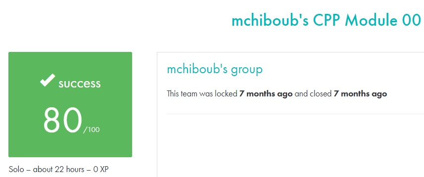

# C++ module 00 #

## What the project does: ##
The C++ - Module 00 project introduces the basics of C++ programming, focusing on object-oriented programming (OOP) concepts such as namespaces, classes, member functions, initialization lists, and more. The project consists of multiple exercises that guide you through creating simple C++ programs like a megaphone and a phonebook.

## Why the project is useful: ##
This project is useful because it serves as the foundation for learning C++ and OOP. It helps you transition from C to C++ while introducing key C++ features like classes and object management, essential for developing more complex software systems.

[Subject of this project](en.subject.pdf)